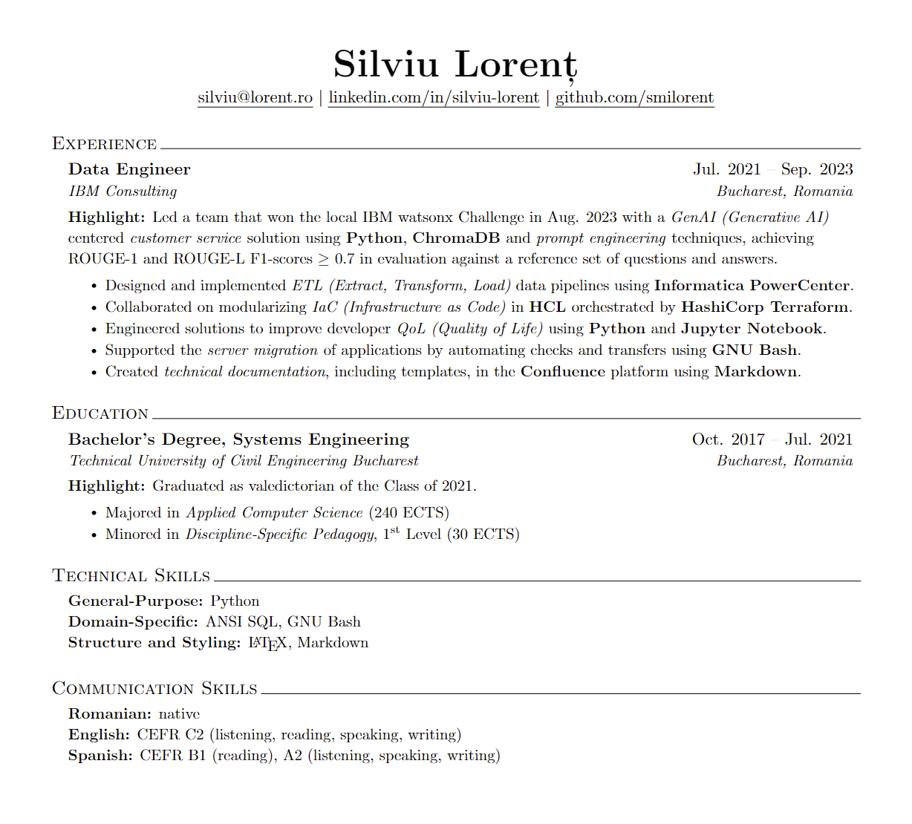

# `smilorent/polymer`

_Polymer_ is a résumé template written in LaTeX, optimized for applicant tracking systems common in HR departments. It is based on the work of [Jake Gutierrez](https://github.com/jakegut/resume).

## Setup

1. To clone this repository, run:

```bash
git clone git@github.com:smilorent/polymer.git
```

2. To install a LaTeX distribution, such as TeX Live, run:

```bash
sudo apt install texlive-full
```

The command above is for Ubuntu and other Debian-based distributions. For other operating systems, please refer to the [TeX Live documentation](https://www.tug.org/texlive/).

3. To build the LaTeX project into a PDF file, run:

```bash
pdflatex -synctex=1 -interaction=nonstopmode -file-line-error -recorder ./polymer.tex
```

4. Finally, if the build is successful, a `polymer.pdf` file will appear under the same directory.

## Preview



## License

The content of this project is licensed under the [MIT License](LICENSE.md).
